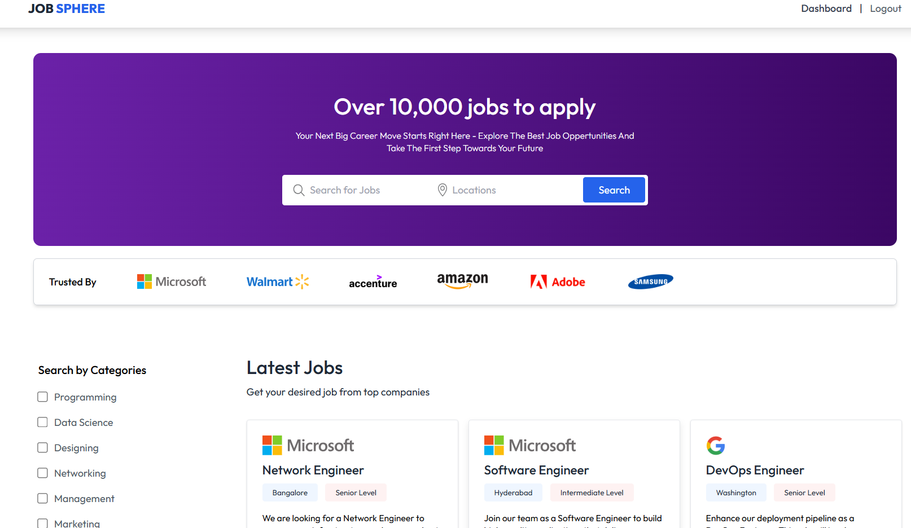

---

````markdown
# 💼 JobSphere Portal

## 📝 Description
**JobSphere** is a full-stack web application that connects job seekers with potential employers. The platform includes features such as job listings, secure authentication, company profiles, resume uploads, recruiter dashboards, real-time messaging, and chatbot assistance. It also supports DevOps deployment using Docker, Jenkins, and AWS EC2.

---

## 🚀 Live Demo
🔗 [https://job-sphere-portal-frontend.vercel.app/](https://job-sphere-portal-frontend.vercel.app/)

---

## 📦 Installation

### 🔧 Backend Setup
```bash
cd Backend
npm install
````

* Create a `.env` file based on `.env.sample` and configure all required variables.
* Start the backend server:

```bash
npm run dev
```

### 🎨 Frontend Setup

```bash
cd Frontend
npm install
npm run dev
```

---

## ⚙️ Usage

* Frontend: `http://localhost:5173`
* Backend API: `http://localhost:5000`

---

## 🌟 Features

* 🔐 Job Seekers & Recruiter Authentication
* 📄 Resume upload/download (Cloudinary + Multer)
* 🧠 AI-powered Chatbot (Gemini API)
* 📋 Job Listings & Applications
* 🏢 Recruiter Dashboards with company profiles
* 🐳 Dockerized Deployment (Frontend + Backend)
* 🔁 CI/CD with Jenkins

---

## 🧠 Tech Stack

### **Frontend:**

* React + Vite
* Tailwind CSS
* React Router

### **Backend:**

* Node.js
* Express.js
* JWT
* Bcrypt
* Multer
* Nodemailer
* Cloudinary

### **Database:**

* MongoDB Atlas

### **AI & Tools:**

* Gemini API

### **DevOps:**

* GitHub
* Docker
* Jenkins

---

## 🐳 Docker Commands

### 🔐 Login:

```bash
docker login
```

### 🔨 Build Images:

```bash
docker build -t padma272/jobsphere-frontend:latest ./Frontend
docker build -t padma272/jobsphere-backend:latest ./Backend
```

### ⬆️ Push Images:

```bash
docker push padma272/jobsphere-frontend:latest
docker push padma272/jobsphere-backend:latest
```

### ⬇️ Pull Images:

```bash
docker pull padma272/jobsphere-frontend:latest
docker pull padma272/jobsphere-backend:latest
```

---

## 📸 Screenshots

### 🏠 Home Page



---

## 🤝 Contributing

Contributions are welcome! Feel free to open issues or submit pull requests for enhancements or bug fixes.

---

## 📄 License

This project is licensed under the [MIT License](LICENSE).

```

---

Let me know if you want:
- Badges (e.g. `Build Passing`, `Docker Pulls`, etc.)
- GitHub Actions support
- To generate a PDF version of this README for offline sharing

Would you like me to update and save this version in a file so you can copy it directly?
```

